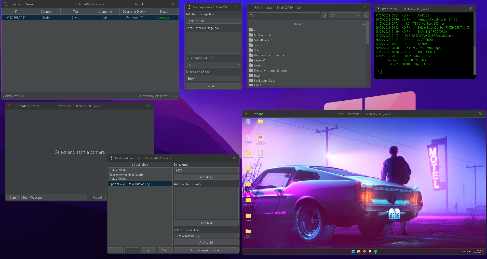

<a name="readme-top"></a>

# SplinterRAT


[![Stargazers][stars-shield]][stars-url]
[![Download][downloads-shield]][downloads-url]
[![MIT License][license-shield]][license-url]
[![LinkedIn][linkedin-shield]][linkedin-url]


<br/>
<div align="center">
  <a href="resources/splinterRatIcon.png">
    
  </a>

  <h3 align="center">Java / C++ RAT</h3>

  <p align="center">
    <i>"You must find the spaces between your thoughts and learn to live there."</i>
    <br />
    <a href="https://github.com/javiarago1/SplinterRAT/blob/main/README.md"><strong>Explore the docs »</strong></a>
    <br />
    <br />
    <a href="https://github.com/javiarago1/SplinterRAT/issues">Report Bug</a>
    ·
    <a href="https://github.com/javiarago1/SplinterRAT/issues">Request Feature</a>
  </p>
</div>


<!-- TABLE OF CONTENTS -->
<details>
  <summary>Table of Contents</summary>
  <ol>
    <li>
      <a href="#about-the-project">About The Project</a>
    </li>
    <li>
      <a href="#getting-started">Getting Started</a>
      <ul>
        <li><a href="#windows-prerequisites">Windows prerequisites</a></li>
      </ul>
    </li>
    <li><a href="#license">License</a></li>
    <li><a href="#contact">Contact</a></li>
  </ol>
</details>


<br>

<!-- ABOUT THE PROJECT -->
## About SplinterRAT



SplinterRAT is a remote administration tool for Windows machines that allows you to take control of the computer the client is running on. The project has two parts:

* Server (<strong>Java</strong>): here we will have a graphical interface, containing the configuration of the client to generate and the server to listen to. We will also have a list of clients connected to our server, from which we can do the actions we want 

* Client (<strong>C++</strong>): this program (<strong>.exe</strong>) will be generated by our server. This client will maintain a communication with the server receiving and sending requests through the TCP protocol. Client features: 
    * File manager (files and folders):
        * copy
        * move
        * delete
        * download
        * upload
        * execute
    * Reverse shell.
    * Webcam manager: 
        * Stream
        * Record
        * Snapshot
    * Keyboard controller: build your own scripts with the graphical interface to take full control over the keyboard.
    * Screen streaming:
        * Graphically view the screen
        * Control de screen
        * Snapshot
    * Message box: shows different types of boxes with own text.
    * Keylogger: saves all keystrokes.
    * Administrator escalation: escalate to higher privileges if necessary with UAC.
    * System state: 
        * Log off
        * Shutdown
        * Reboot
    * Connetion:     
        * Restart
        * Disconnect
        * Uninstall


<p align="right">(<a href="#readme-top">back to top</a>)</p>


<!-- GETTING STARTED -->
## Getting Started

Firstly, to run the server and the graphical interface it's necessary to have the <a target="_blank" href="https://www.java.com/">Java JRE (17 or superior) </a>installed. <br>
Secondly, it is necessary to have the C++ compiler collection (g++) 12.0.0 version and windres utility installed for assembly configuration and compilation. Recomendation for this -> <a target="_blank" href="https://www.mingw-w64.org/">MinGW-w64</a>.

<br/>

## Download 

Download from release page either SplinterRAT<strong>.exe</strong> (Windows only) or SplinterRAT<strong>.jar</strong>. 

<a href="https://github.com/javiarago1/SplinterRAT/releases/">Click here to download last version</a>

<br>

### Windows prerequisites

For windows install <a target="_blank" href="https://www.msys2.org/">MSYS2</a> and then download and install <strong>mingw-w64</strong>.

* msys2
```sh
pacman -S mingw-w64-x86_64-toolchain
```
* Add to Windows PATH environment variable

```sh
C:\msys64\mingw64\bin
```

<br/>

## Disclaimer

* You're responsible for everything you do with SplinterRAT. 
* This program can only be installed on machines with legal permission.
* This program can only be used for ethical hacking purposes.

<br/>

<!-- LICENSE -->
## License

Distributed under the MIT License. See `LICENSE` for more information.

<p align="right">(<a href="#readme-top">back to top</a>)</p>


[downloads-shield]:https://img.shields.io/github/downloads/javiarago1/splinterRAT/total?style=for-the-badge
[downloads-url]: https://github.com/javiarago1/SplinterRAT/releases/
[stars-shield]: https://img.shields.io/github/stars/javiarago1?style=for-the-badge
[stars-url]: https://github.com/javiarago1/SplinterRAT/stargazers
[license-shield]: https://img.shields.io/github/license/javiarago1/SplinterRAT?style=for-the-badge
[license-url]: https://github.com/javiarago1/SplinterRAT/blob/main/LICENSE
[linkedin-shield]: https://img.shields.io/badge/-LinkedIn-black.svg?style=for-the-badge&logo=linkedin&colorB=555
[linkedin-url]: https://www.linkedin.com/in/javier--aragoneses/

